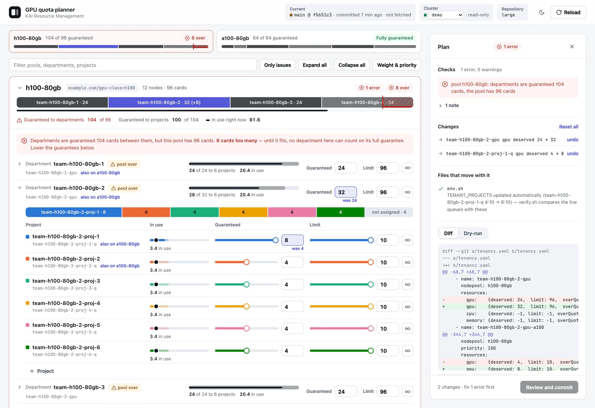

# krm-quota-planner

**Plan GPU quotas for [KAI Resource Management](https://github.com/kai-scheduler) (KRM)** on your laptop — with a picture of who gets what, checks the cluster does not enforce, and a safe way to apply the change.

Licensed under the [MIT License](LICENSE).



*A plan in progress on the bundled demo (160 GPUs, 8 departments, 48 projects). One department was given 8 more H100 cards, which the pool does not have: the pool's bar shows the overflow in red and the department that moved in colour, every department on that pool is flagged, and the plan cannot be committed until it fits.*

## What this tool is for

If you run KRM, GPU capacity is split across **departments** (guarantees on a node pool) and **projects** (each tied to a Kubernetes namespace). Changing those numbers is easy to get wrong: children can add up to more than a parent, limits can disagree with guarantees, and a namespace quota in git can drift from the queue in the tenancy file.

**krm-quota-planner** helps you:

- **See** the split — bars per department, rows per project, and (when the cluster is reachable) how much is in use right now
- **Change** deserved, limit, and over-quota weight with sliders, or add node pools, departments, projects, and extra queues
- **Catch mistakes before apply** — arithmetic and structural rules KRM often accepts anyway
- **Ship the change** — `kubectl patch` / `create` commands for a live cluster, or a **local git commit** on a new branch when quotas live in GitOps

Nothing is pushed and nothing is applied for you. You review the diff or commands, then run them yourself.

**Good fit:** platform or cluster admins who own KRM tenancy, especially when edits touch more than one file (tenancy YAML, verify scripts, namespace ResourceQuotas).

**Not a fit:** clusters without KRM; manifest folders that are not a git repo; hosted multi-tenant SaaS (this is a local tool only).

## How it works

```text
  Read base          Adjust in the UI        Export
  ─────────          ───────────────        ──────
  cluster  ──┐       sliders + adds    →    kubectl commands
             ├──►    checks + diff          or
  git ref  ──┘                            local commit (git mode)
```

| Mode | You start from | You finish with |
|---|---|---|
| **Cluster** (default) | Whatever your `kubectl` context points at | Commands to patch/create KRM objects |
| **Git** | A ref in a clone (`--repo` + `--tenancy`) | One commit on a new local branch (checkout untouched) |

If Argo CD or Flux owns the objects, prefer **git** mode — a patch on the cluster is overwritten on the next sync.

## Quick start

**Requirements:** Node 20+, `kubectl` with access to `nodepools`, `departments`, and `projects` in `kai.resources` (git mode also needs `git`).

**Screenshots / offline demo** (no real cluster): `npm run demo:generate` then `npm run demo` — see [examples/demo/README.md](examples/demo/README.md).

```sh
npm install
npm start                      # http://localhost:4780
```

Open the URL in your browser. With no flags, the planner uses your **current kubectl context**.

**GitOps example** (optional profile — point `repo` at your own clone):

```sh
npm start -- --config examples/gitops.json
```

## Why the checks matter

KRM and KAI do **not** fully validate quota arithmetic. In practice, webhooks can accept guarantees that exceed a department, a deserved above its limit, or a department above the pool’s card count; many issues only show up as “this stopped being a guarantee.”

This tool implements the guardrails you want **before** merge or apply: the UI makes the split obvious, and the **Checks** panel blocks export when something is inconsistent.

## Command-line options

Use the mode that matches where tenancy is **defined**.

```
--source <cluster|git>   default: cluster — or git when --repo is set

--context <name>         kubectl context (default: current; also switchable in the page)
--kubeconfig <file>      kubeconfig file

--repo <path>            git: repository clone          (or $QUOTA_PLANNER_REPO)
--tenancy <path>         git: path to the tenancy YAML inside the repo
--ref <ref>              git: base ref                    (default origin/main)
--no-fetch               git: skip git fetch before reading ref
--no-cluster             git: no kubectl — no usage, capacity, or dry-run

--config <file>          JSON profile (repo, tenancy, coupled files — see below)
--port <n>               port                             (default 4780)
```

Flags override environment variables; paths in a profile are relative to that file.

## Connecting to the cluster

The planner has no separate login — it runs `kubectl` the same way you do. If `kubectl get departments.kai.resources` works in your terminal, the planner can read that cluster.

| Goal | How |
|---|---|
| Default context | Just start the app |
| Another context | Pick it at the top of the page, or `--context <name>` |
| Another kubeconfig | `--kubeconfig <file>` or `$KUBECONFIG` |

From **cluster** mode, switching context discards unapplied edits (you are prompted). From **git** mode, switching only changes which cluster supplies usage and dry-run.

The cluster is **read-only** here: `get` plus optional `apply --dry-run=server`. Card counts and live usage are overlays for warnings, not the source of truth for git plans.

## What it reads and writes

| | |
|---|---|
| **Cluster base** | `kubectl get` of NodePools, Departments, Projects — only `spec` is kept so usage in status does not churn the base. |
| **Git base** | `git show <ref>:path` — not the working tree; ref is fetched first unless `--no-fetch`. |
| **Cluster overlay** | Pool capacity and per-queue usage when kubectl can reach the cluster. |
| **Cluster output** | `kubectl patch` / `create` commands (test-then-replace, givers before takers). |
| **Git output** | Local commit on a new branch via git plumbing — your checkout and index stay as they were. |

## Adding objects

Use **Add to the plan** for node pools, departments, projects, and extra queues (one queue per pool per object in KRM).

| Kind | You provide |
|---|---|
| **Node pool** | Name + one label key/value (immutable after create) |
| **Department** | Name, pool, guarantee, limit |
| **Project** | Name, namespace, department, pool, numbers |
| **Queue on another pool** | Department or project, second pool, numbers |

New queues always include `gpu`, `cpu`, and `memory` (`cpu`/`memory` default to unlimited in the UI). The tool does **not** create namespaces or label nodes — it tells you what is still missing.

`ManagedNodesConfig` and `KRMConfig` are not edited here (whitelist is read for checks only).

## Git edits stay surgical

Tenancy YAML often keeps numbers in aligned columns with comments between them. The planner **does not re-serialize** the file: each change patches one value’s bytes and padding, so a single quota tweak is a one-line diff and comments survive.

From a cluster, the same logical edit becomes a guarded JSON Patch in the printed commands.

## What it checks

Errors block **Create local commit** and **Show kubectl commands**; you can still read the diff. Plans are tied to the base at load time — if the ref or cluster spec moves, reload and re-check before applying.

| Level | Rule |
|---|---|
| error | Projects' guarantees add up to more than their department's, per pool |
| error | A guarantee above its own limit (or unlimited under a finite limit) |
| error | Departments guaranteed more cards than the pool has |
| error | Negative values other than `-1`; unknown node pool or parent department |
| error | A queue name used by two objects, or two projects on one namespace — KRM accepts both |
| error | Two queues on one pool in one object, or two pools selecting the same label pair (KRM rejects these too) |
| warning | A project queue on a pool where its department has none — KRM accepts it, and the guarantee is part of no department's share |
| warning | A new pool that no node is labelled for, or whose nodes the `ManagedNodesConfig` whitelist does not cover |
| warning | A new project whose namespace does not exist, is not labelled for it, or belongs to another project — KRM accepts the project regardless |
| warning | A project limit above its department's (the department wins) |
| warning | In use right now above the planned limit, or non-preemptible use above the planned guarantee — nothing is evicted, so the change does not take effect until those stop |
| warning | Some of the pool's cards are not schedulable right now (node not ready, device plugin restarting) — the capacity rule above drops to a warning until they are |
| warning | From a cluster: the objects are managed by Argo CD or Flux, which will put a live change back |
| warning | From git: CPU or memory quotas changed, when the profile sets a `cpuMemoryNote` (e.g. a verify script asserts they are unlimited) |
| note | Part of a department's share is not guaranteed to any project |
| note | The scheduler's Queues hold different numbers from the source (git not synced yet, KRM not reconciled yet, or a Queue edited directly) |
| note | From git: a comment sits on a value the plan changes — the number is updated, the wording is not |

## Files that move with a quota (git mode)

Queues are often duplicated in shell vars or namespace ResourceQuotas. A `--config` profile can name:

- **`expectations`** — variables a verify script compares to live queues (rewritten automatically)
- **`resourceQuotaMirrors`** — ResourceQuotas mirroring a queue’s limit in whole cards (optional tick box in the UI)
- **`reminders`** — paths to update manually (changelog, runbooks) listed in the plan message

See [`examples/gitops.json`](examples/gitops.json).

## Scope

**In scope:** GPU `deserved`, `limit`, `overQuotaWeight`, queue `priority`; adding pools, departments, projects, queues.

**Not yet:** delete/rename; move projects between departments; edit `ManagedNodesConfig` or pool scheduler settings; CPU/memory in the UI; apply/push for you; CI integration; non-git manifest-only trees; hosted deployment.

For production safety, many teams add a repo check that runs the same rules on PRs touching tenancy — this tool is the interactive half, not the gate.

## Safety of the local server

Binds to `127.0.0.1`, validates `Host`, and requires a per-session token on API calls. `git` and `kubectl` are invoked with argument arrays, not a shell.

## Development

```sh
npm test              # unit + API tests (no browser)
npm run test:e2e      # Playwright UI smoke (git mode, fixture repo)
npm run test:all      # both
```

Browser tests start a throwaway git repo and planner on port **4791** (`E2E_PORT` to override). They need Chromium once: `npx playwright install chromium`.

Layout: pure rules in `src/core/`; `src/sources.js` + `src/git.js` / `src/cluster.js` for inputs; `src/server.js`; static UI in `public/`. Runtime dependency: [`yaml`](https://eemeli.org/yaml/) (ISC). Tests use a fake `kubectl` in `test/fixtures/bin`.

## Open source

Released under the **[MIT License](LICENSE)**.

| Topic | Where |
|---|---|
| License | [LICENSE](LICENSE) |
| Contributing | [CONTRIBUTING.md](CONTRIBUTING.md) |
| Security | [SECURITY.md](SECURITY.md) |
| Example profile | [examples/gitops.json](examples/gitops.json) |

KAI, kubectl, and cluster data remain under their own terms; this project does not bundle them.
